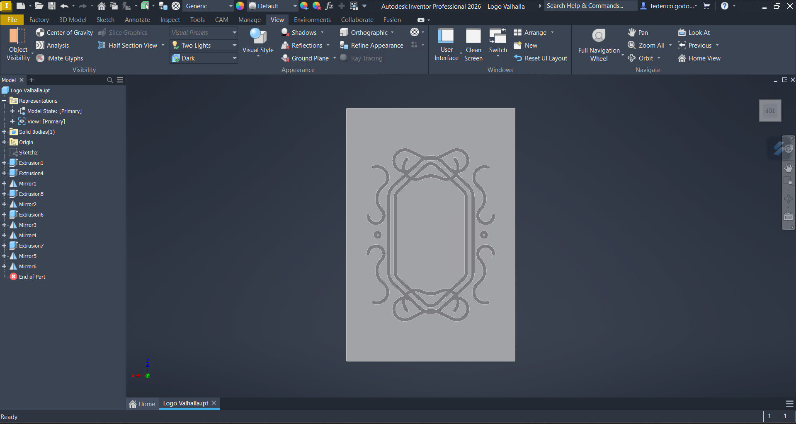

## CNC Proyect

This CNC project was an introduction to the subject of Computer Numerical Control. A part was designed in Autodesk Inventor, then modeled in Autodesk CAM as a manufactured part, and the parameters were adjusted for a HAAS 3-axis CNC machine. All parameters were taken into account for an acrylic plate, and then the code was generated and reviewed in post-processing. 
Subsequently, the G code was simulated in Inventor HSM, and finally, the part was created on the HAAS VF-1 machine in the university laboratory.
The repository includes the G code, drawings of the part, and a final image of the plate with the final engraving.

## Initial Design of the Figure
The design of this piece was created in Autodesk Inventor, using a familiar brand as a reference, and the logo was created from scratch to achieve the following result.

